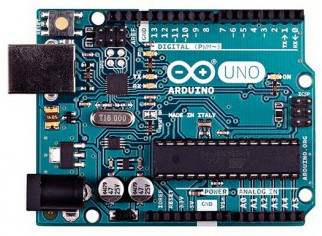
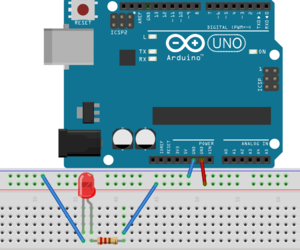
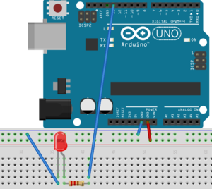

# Arduino - prise en main

## Pré-installation (Arduino stuff)



  * Vous devrez surement installer les paquets suivants (Linux): `arduino` ,
`gcc-avr` (or `avr-gcc`) et `avrdude` (`avr-binutils` et `avr-libc` s'ils ne sont pas inclus)
  * `avrdude.conf` doit se trouver dans `/usr/share/arduino/hardware/tools/` (sinon il faut modifier les Makefiles).
  * L'utilisateur doit avoir le droit d'écrire sur le port USB (plus besoin de le faire à priori) :
`usermod -aG dialout <username>` (and re-login).


## Informations générales

Les cartes Arduino/Genuino utilisent un micro-controlleur AVR
Atmel. Dans ce TP, nous allons utiliser des Arduino UNOs (atmega328p).

Le micro-controlleur est lui-même programmé avec un bootloader: il
n'est pas nécessaire d'avoir un OS. Le Makefile qui vous est fourni
utilise `avrdude` ([doc](http://www.nongnu.org/avrdude/)) pour charger
le binaire sur la mémoire du micro-controlleur.

Nous vous fournissons une plateforme Arduino UNO complète avec des
LEDs, un breadboard, des cables... **Vous en êtes responsable pendant
les deux TPs et si vous l'emmenez chez vous pour terminer les TPs**.

## Point de départ avec le breadboard

Tout d'abord, réalisons un circuit simple afin de tester le board : 



Le board doit être alimenté: la ligne bleu/noire sur la terre de
l'arduino (GND) et la ligne rouge sur le +5V de l'arduino. Si vous
brancher l'arduino sur un port USB de votre machine, la LED doit
clignoter. Attention, il faut utiliser une résistance de 220 ohm en série
avec la LED.
**A partir de maintenant les schémas supposerons que ces deux connections sont établies**/

### LED sur la broche Digital 13

* LED sur la broche (pin) Digital 13 avec une résistance de 220 ohm.



* TODO : Tester le code fourni dans `_code/blinkingled` (make, make upload)
  
### Comprendre le style de programmation Arduino

Voici le squelette de code que nous utiliserons pour programmer l'Arduino :

```C
#include <avr/io.h>
#include <util/delay.h>

void setup(void) {}

int main(void)
{
  setup();
  while(1)
  {
    // Business code goes here
    _delay_ms(1000);
  }
}
```

La partie `setup` correspond à l'initialisation du board, afin de spécifier quels ports sont utilisés en entrée (input) ou sortie (ouput).
Le programme implémente une boucle infinie, où le code utilisateur sera appelé.

Afin de changer l'état d'une LED de on a off, il faut :

* configurer le port/pin auquel la LED est connecté en
  _output mode_ (dans la procédure `setup`)

* écrire un 0 (off) ou un 1 (on) sur le même port pour changer l'état.

Quelques informations:

* Comme la LED utilise le pin Digital 13, the port à manipuler est DDRB.
  Toutes les pins de 8 à 13 doivent pour l'instant être configurés en _input mode_ (0),
  sauf la pin 5 qui fournit un accès "output" à la LED (1).

* Afin de faire clignoter la LED, il est recommandé d'utiliser l'opérateur xor
  afin de changer le 5ème bit de 0 à 1 ou de 1 à 0 chaque fois que le code entre
  dans la boucle: `PORTB ^= 0bxxxxxxxx;' (remplacer x avec les valeurs des bits).

### Documentation complémentaire

Autres liens :

* [Manipulation des ports](https://www.arduino.cc/en/Reference/PortManipulation). Attention,
cette documentation est dédiée au format "Arduino Lib". En C, vous devez utiliser
`0b11111110` (plutôt que `B11111110`).

* [Opérateurs Booléens](http://playground.arduino.cc/Code/BitMath),

* [AVR libc documentation for "delay"](http://www.nongnu.org/avr-libc/user-manual/group__util__delay.html).

* Une erreur classique `avrdude:stk500_recv(): programmer is not responding` peut être résolue en enlevant toute conenction au port digital 1 avant l'upload.

**Aide mémoire :**

Le port d'entrée/sortie appélé PORTB correspond aux broches numériques (digital pins) 8 à 13
sur l'Arduino UNO. Les deux bits de poids forts (6 et 7) correspondent à des broches qui ni
doivent pas être utilisées par le programmeur. Ce port peut être manipulé grâces aux macros
suivantes :

* DDRB : le registre de direction des données du port B (entrée 0, sortie 1)

* PORTB : le registre d'écriture des valeurs des broches du port B (écriture)

* PINB : le registre de lecture de l'état des broches d'entrée du port B (lecture seule)
