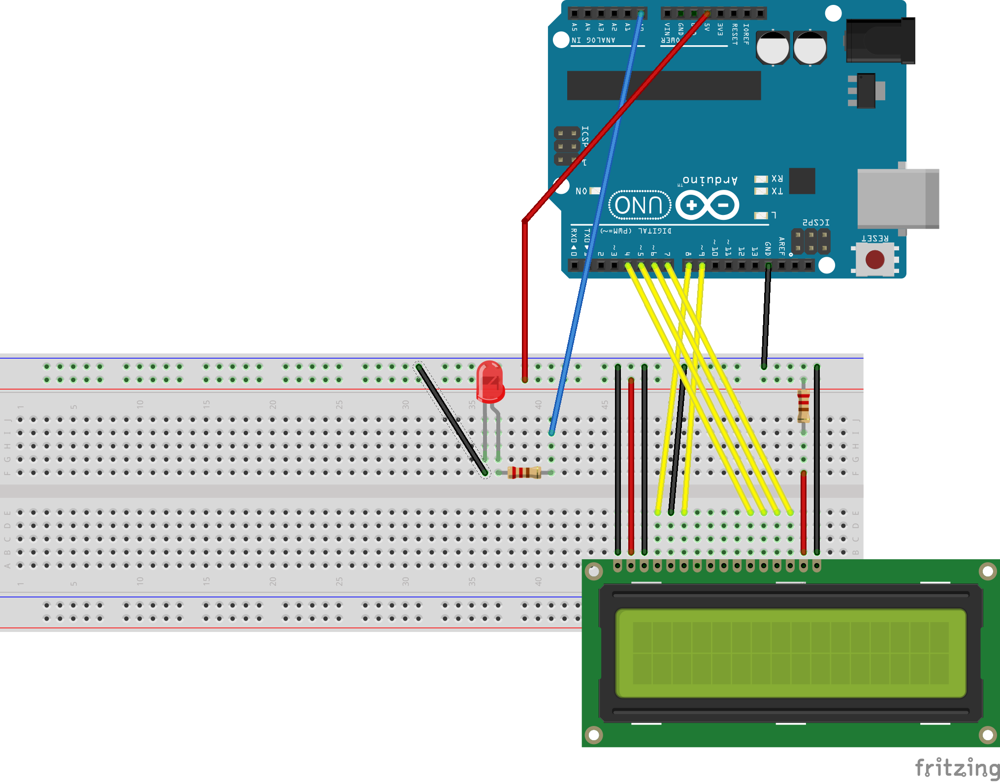

# Arduino startup ordonnanceur

## Pre-installation (Arduino stuff)

* Schéma du montage : 2 leds avec résistance 220ohm~: rouge sur analog 0, jaune sur analog1, et un écran LCD sur Digital 5 à 9 comme sur le dessin ci-dessous.

  

Les deux LEDs sont câblées comme précédemment.
* Le LCD est relié aux ports ``digital'' suivant lcd(4)-> D8, lcd 6->
  D9, lcd11 -> D4, lcd 12 -> D5, lcd13 -> D6, lcd14 -> D7.
* Le reste du branchement sert à assurer l'alimentation, la
  stabilité, et le contraste.

## Test de l'écran et du montage

* C'est dans `_code/testLCD`.
* Test: Après upload du .hex, l'écran LCD doit afficher "Hello" et les deux LED sont allumées.
